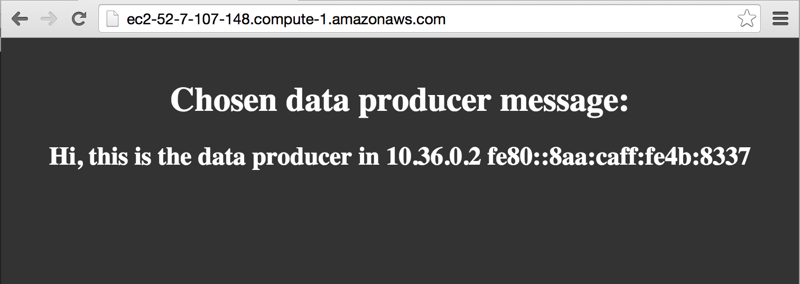
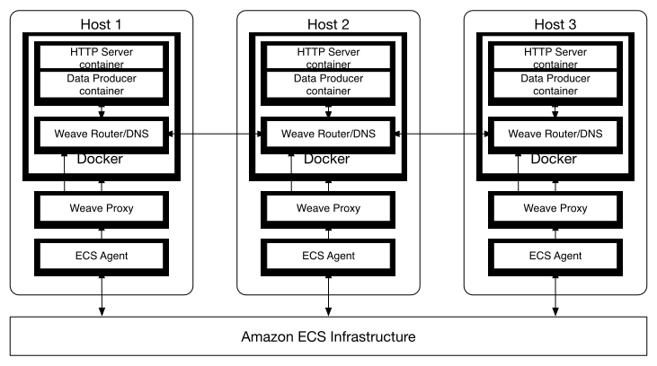

## What you will build ##

Weave allows you to focus on developing your application, rather than your
infrastructure.

In this example you will use Weave for service discovery and load balancing
between [containers on ECS](http://aws.amazon.com/ecs/).

Two types of containerized microservices are used in this example: HTTP Servers and Data
Producers.


The HTTP Servers will serve data produced from the Data
Producers.

This is a very common pattern, whose implementation requires answers to the following questions:

1. Service discovery: How does an HTTP Server find a Data Producer to connect to?
2. Load balancing/fault tolerance: How can the HTTP Servers make uniform use of
  all the Data Producers?

Weave, makes use of
[WeaveDNS](http://docs.weave.works/weave/latest_release/weavedns.html), where
it automatically and transparently:

* Implements service discovery by adding DNS A-records for your containers based on
their names. and, 
* Secondly, manages load balancing by randomizing the order of DNS responses.

## What you will use ##

* [Weave](http://weave.works)
* [Docker](http://docker.com)
* [Amazon ECS](http://aws.amazon.com/ecs/)

## What you will need to complete this guide ##

This getting started guide is self contained. You will use Weave, Docker and
Amazon ECS. We also make use of the
[Amazon Web Services (AWS) CLI tool](http://docs.aws.amazon.com/cli/latest/userguide/cli-chap-welcome.html)
to manage and access AWS.  You will need a valid
[Amazon Web Services](http://aws.amazon.com) account, and have the AWS CLI setup and
configured before working through this guide. Amazon provides an
extensive guide on how to setup the
[AWS CLI](http://docs.aws.amazon.com/cli/latest/userguide/cli-chap-getting-set-up.html).

* 15 minutes
* [Git](http://git-scm.com/downloads)
* [AWS CLI >= 1.7.35 ](http://docs.aws.amazon.com/cli/latest/userguide/cli-chap-welcome.html)
* [bash](https://en.wikipedia.org/wiki/Bash_(Unix_shell))
* An [SSH client](https://en.wikipedia.org/wiki/Comparison_of_SSH_clients) (optional)

## Getting the code ##

All of the code for this example is available on GitHub.

First, clone the `weaveworks/guides` repository and then move to the `aws-ecs`
directory, from which you will be working throughout most of this guide.

``` bash
git clone http://github.com/weaveworks/guides
cd guides/aws-ecs
```

## AWS-CLI configuration ##

Make sure AWS-CLI is set to use a region where ECS is available
(`us-east-1`, `us-west-2`, `eu-west-1`, `ap-northeast-1` or `ap-southeast-2` at
the time of writing this guide).

You can see AWS-CLI's  configuration with
```bash
aws configure list
```
and modify it by running:
```bash
aws configure
```
## Automatic setup ##

To set everything up automatically, just run the following command:
```bash
./setup.sh
```
You should get an output like the following:

    Creating ECS cluster (weave-ecs-demo-cluster) .. done
    Creating Security Group (weave-ecs-demo) .. Done
    Creating Key Pair (weave-ecs-demo, file weave-ecs-demo-key.pem) .. done
    Creating IAM role (weave-ecs-role) .. done
    Creating Launch Configuration (weave-ecs-launch-configuration) .. done
    Creating Auto Scaling Group (weave-ecs-demo-group) with 3 instances .. done
    Waiting for instances to join the cluster (this may take a few minutes) .. done
    Registering ECS Task Definition (weave-ecs-demo-task) .. done
    Launching (3) tasks .. done
    Waiting for tasks to start running .. done
    Setup is ready!
    Open your browser and go to any of these URLs:
      http://foo.region.compute.amazonaws.com
      http://bar.region.compute.amazonaws.com
      http://baz.region.compute.amazonaws.com


## What just happened? ##

The automatic `setup.sh` script:

* Created an ECS cluster named `weave-ecs-demo-cluster`
* Spawned three hosts (EC2 instances in Amazon's jargon), which are now part of
  the cluster and are based on Weave's ECS
  [AMI](https://en.wikipedia.org/wiki/Amazon_Machine_Image).
* Created an ECS task family definition that describes the HTTP Server and Data Producer containers.
* Spawned three tasks, one per host, resulting in an HTTP Server and a Data Producer container running on each host.

## Testing the setup ##

The three URLs shown above, which is the result of `setup.sh`'s output will communicate via your browser with the HTTP Server containers. Pick one of them (or all three of them if
you like) and open them in your browser. 

This is what you should see:



Press reload in your browser to refresh the HTTP Server and reload the server's Data
Provider address list (generated randomly by `WeaveDNS`), resulting in
load-balancing between them.

## How does service discovery and load balancing work? ##

Both the HTTP Server and the Data Producer containers are very simple (naive if you
may).

They are implemented in a few lines of bash, mostly using Netcat.

Container `dataproducer`:

```bash
while true; do
  echo 'Hi, this is the data producer in' `hostname -i` | nc -q 0 -l -p 4540
done
```

Container `httpserver`:

```bash
sleep 7 # Wait for data producers to start
  while true; do
  # Get a message from a data producer
  DATA_PRODUCER_MESSAGE=`nc dataproducer 4540`
  HTML="<html> <head> <title>Weaveworks Amazon ECS Sample App<\/title> <style>body {margin-top:   40px; background-color: #333;} <\/style> <\/head><body> <div style=color:white;text-align:center> <h1>Chosen data producer message:<\/h1> <h2>${DATA_PRODUCER_MESSAGE}<\/h2> <\/div>"
  echo "$HTML" | nc -q 0 -l -p 80
done
```

Note that, for clarity purposes, the sources above have been slightly reformatted.




When ECS launches a container, the call to Docker is intercepted by WeaveProxy,
which allocates an address using weave's automatic ip allocation, registers the
container in WeaveDNS and attaches it to the weave network. WeaveDNS will
register A-records based on the container's name:

* A `dataproducer` A-record for all the Data Producer containers.
* A `httpserver` A-record for all the HTTP Server container.

The Data Producer waits for requests on TCP port 4540 and responds with a string containing its IP.

The HTTP Server works as follows:

1. Contact a Data Producer and obtain its message (`nc dataproducer 4540`). This
   will implicitly do load balancing due to WeaveDNS' response randomization
   (more about it this in next section).
2. Compose some HTML with the information obtained in (1) and (2).
3. Wait for a browser to connect.


## What's happening in the hosts? ##

If you are curious about what's happening in the ECS instances, you can access
them through ssh:

```bash
    ssh -i weave-ecs-demo-key.pem ec2-user@${INSTANCE}
```

where `${INSTANCE}` can be any of your 3 instance hostnames
(`foo.region.compute.amazonaws.com`, `bar.region.compute.amazonaws.com` or
`baz.region.compute.amazonaws.com` in the `setup.sh` example listing above).

For example, you can list what containers are running in the instance:

    [ec2-user@ip-XXX-XXX-XXX-XXX ~]$ docker ps
    
    
    CONTAINER ID        IMAGE                            COMMAND                CREATED             STATUS              PORTS                                                                                            NAMES
    e2fe07ab4768        2opremio/weaveecsdemo:latest     "\"/w/w bash -c 'sle   7 minutes ago       Up 7 minutes        0.0.0.0:80->80/tcp                                                                               ecs-weave-ecs-demo-task-1-httpserver-9682f3b0cd868cd60d00
    42658f9eaef5        2opremio/weaveecsdemo:latest     "/w/w sh -c 'while t   7 minutes ago       Up 7 minutes                                                                                                         ecs-weave-ecs-demo-task-1-dataproducer-b8ecddb78a8fecfc3900
    18db610b28f7        amazon/amazon-ecs-agent:latest   "/w/w /agent"          8 minutes ago       Up 8 minutes        127.0.0.1:51678->51678/tcp                                                                       ecs-agent
    4221747c81e3        weaveworks/weaveexec:latest      "/home/weave/weavepr   8 minutes ago       Up 8 minutes                                                                                                         weaveproxy
    9457fff981b8        weaveworks/weave:latest          "/home/weave/weaver    8 minutes ago       Up 8 minutes        0.0.0.0:6783->6783/tcp, 0.0.0.0:6783->6783/udp, 172.17.42.1:53->53/tcp, 172.17.42.1:53->53/udp   weave


* Container `ecs-weave-ecs-demo-task-1-httpserver-9682f3b0cd868cd60d00` is the
  HTTP Server of this host, producing the output you saw in your browser.  Note
  how container names are mangled by ECS to
  `ecs-${TASK_FAMILY_NAME}-${TASK_FAMILY_VERSION}-${STRIPPED_CONTAINER_NAME}-${UUID}`.

* Container `ecs-weave-ecs-demo-task-8-dataproducer-b8ecddb78a8fecfc3900` is the
  Data Producer of this host.

* Containers `weaveproxy` and `weave` are unsurprisingly responsible for running
  Weave in each ECS instance. For simplification, the proxy was represented out
  of Docker in previous section's diagram, but it so happens that WeaveProxy runs
  inside of Docker.

* Container `ecs-agent`, also unsurprisingly, corresponds to
  [Amazon's ECS Agent](https://github.com/aws/amazon-ecs-agent), which runs on
  all ECS instances and starts containers on behalf of Amazon ECS. Again, for
  simplification, the ECS Agent was represented out of Docker in previous
  section's diagram.


To view the IPs of all the HTTP Servers and Data Producers by running:


    [ec2-user@ip-XXX-XXX-XXX-XXX ~]$ export DOCKER_HOST=unix:///var/run/weave.sock # Use weave-proxy
    [ec2-user@ip-XXX-XXX-XXX-XXX ~]$ docker run 2opremio/weaveecsdemo dig +short httpserver
    10.36.0.3
    10.32.0.3
    10.40.0.2
    [ec2-user@ip-XXX-XXX-XXX-XXX ~]$ docker run 2opremio/weaveecsdemo dig +short dataproducer
    10.36.0.2
    10.32.0.2
    10.40.0.1

Running the commands above multiple times will result in different orderings in
the output. This is because WeaveDNS randomizes the order of the IPs, which in
turn causes HTTP Servers to transparently do load balancing when connecting to
Data Producers.

### Cleanup ###

To clean up everything which was created by `setup.sh` run:
```bash
./cleanup.sh
```

## Manual Setup ##

You may want more details about how set up an ECS Cluster with Weave.
Follow these steps to manually reproduce what `./setup.sh` is doing
automatically.

### Create ECS Cluster ###

```bash
aws ecs create-cluster --cluster-name weave-ecs-demo-cluster
```

### Create Security Group and Key Pair ###

Create the security group `weave-ecs-demo`

```bash
SECURITY_GROUP=$(aws ec2 create-security-group --group-name weave-ecs-demo --description 'Weave ECS Demo' --query 'GroupId' --output text)
```

Add inbound rules to the group in order to allow:

* Public SSH access.
* Public HTTP access.
* Private Weave access between instances.

```bash
aws ec2 authorize-security-group-ingress --group-name weave-ecs-demo --protocol tcp --port 22 --cidr 0.0.0.0/0
aws ec2 authorize-security-group-ingress --group-name weave-ecs-demo --protocol tcp --port 80 --cidr 0.0.0.0/0
aws ec2 authorize-security-group-ingress --group-name weave-ecs-demo --protocol tcp --port 6783 --source-group weave-ecs-demo
aws ec2 authorize-security-group-ingress --group-name weave-ecs-demo --protocol udp --port 6783 --source-group weave-ecs-demo
```

Next you create a key pair which allows us to access any EC2 instances which are associated with this security group.

```bash
aws ec2 create-key-pair --key-name weave-ecs-demo-key --query 'KeyMaterial' --output text > weave-ecs-demo-key.pem
```

### IAM Role ###

Create a IAM role for the Weave ECS instances 

```bash
aws iam create-role --role-name weave-ecs-role --assume-role-policy-document file://data/weave-ecs-role.json
aws iam put-role-policy --role-name weave-ecs-role --policy-name weave-ecs-policy --policy-document file://data/weave-ecs-policy.json
aws iam create-instance-profile --instance-profile-name weave-ecs-instance-profile
aws iam add-role-to-instance-profile --instance-profile-name weave-ecs-instance-profile --role-name weave-ecs-role
```

## Create Launch Configuration ##

Choose a Weave ECS AMI depending on your configured region:

* `us-east-1` -> `ami-97b86afc`
* `us-west-2` -> `ami-69d3de59`
* `eu-west-1` -> `ami-d26d25a5`
* `ap-northeast-1` -> `ami-083b8f08`
* `ap-southeast-2` -> `ami-1d80c627`


and execute the command below replacing `XXXX` with the AMI of your region.

```bash
AMI=XXXX aws autoscaling create-launch-configuration --image-id ${AMI} --launch-configuration-name weave-ecs-launch-configuration --key-name weave-ecs-demo-key --security-groups ${SECURITY_GROUP} --instance-type t2.micro --user-data file://data/set-ecs-cluster-name.sh  --iam-instance-profile weave-ecs-instance-profile --associate-public-ip-address --instance-monitoring Enabled=false
```

## Create Auto Scaling Group ##

You are going to create an Auto Scaling Group with 3 instances in the first subnet available in your region.

```bash
SUBNET=$(aws ec2 describe-subnets --query 'Subnets[0].SubnetId' --output text)
aws autoscaling create-auto-scaling-group --auto-scaling-group-name weave-ecs-demo-group --launch-configuration-name weave-ecs-launch-configuration --min-size 3 --max-size 3 --desired-capacity 3 --vpc-zone-identifier ${SUBNET}
```

### Register Task Definition ###

```bash
aws ecs register-task-definition --family weave-ecs-demo-task --container-definitions "$(cat data/weave-ecs-demo-containers.json)"
```


### Launch Task ###

Before launching the demo task, confirm that the 3 instances from the Auto
Scaling Group have joined the cluster. This should should happen shortly after
creating the Auto Scaling Group.

To confirm it, run the following command. The output will show `3` once all the instances are part of the cluster.

```bash
aws ecs describe-clusters --clusters weave-ecs-demo-cluster --query 'clusters[0].registeredContainerInstancesCount' --output text
```

Now, launch the demo task. You will be launching 3 task instances, one per EC2
instance in the Auto Scaling Group.

```bash
aws ecs run-task --cluster weave-ecs-demo-cluster --task-definition weave-ecs-demo-task --count 3
```

## Summary ##

You have used Weave out-of-the-box in ECS, both for service discovery and load
balancing between containers on ECS, regardless of whether they are executed on the same or
on different hosts.

## Known issues/limitations ##

* Auto Scaling Groups are required for ECS to work with Weave. If you create individual
  instances, they won't work be able to see each other due to how Weave finds peers in ECS.
* Due to how ECS mangles container names at launch, Weave's service discovery is
  only supported in container names with alphanumeric characters
  (e.g. `httpserver` would be OK but `http-server` won't work due to the hyphen)


## For the advanced user: Build your own Weave ECS AMI ##


Clone the guides repository if you haven't done so yet and go to the `packer`
directory.

```bash
git clone http://github.com/weaveworks/guides
cd guides/aws-ecs/packer
```

First, build special versions `ecs-init` and `weave`. You will need to have
Docker installed for this to work.

```bash
./build-ecs-init-weave.sh
```

Next, download a SFTP-enabled version of [Packer](https://www.packer.io/) to build
the AMI.

```bash
wget https://dl.bintray.com/2opremio/generic/packer-sftp_0.8.1_linux_amd64.zip
unzip packer-sftp_0.8.1_linux_amd64.zip -d ~/bin
```

Finally, invoke `./build-all-amis.sh` to build `Weave ECS` images for all
regions. This step installs (in the image) the version of ecs-init we just
built, AWS-CLI, jq, Weave/master, init scripts for Weave and updates the ECS
agent to use WeaveProxy.

You can customize the image by modifying `template.json` to match your
requirements.

```bash
AWS_ACCSS_KEY_ID=XXXX AWS_SECRET_ACCESS_KEY=YYYY  ./build-all-amis.sh
```

This can be a lengthy process, so if you want to build an image just
for a specific region set the environment variable `ONLY_REGION` to the specific
region you want to build the image for. For instance:

```bash
ONLY_REGION=us-east-1 AWS_ACCSS_KEY_ID=XXXX AWS_SECRET_ACCESS_KEY=YYYY  ./build-all-amis.sh
```
