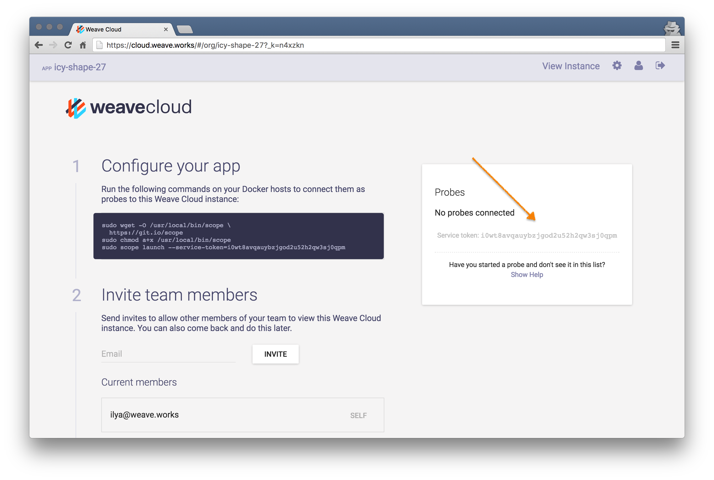
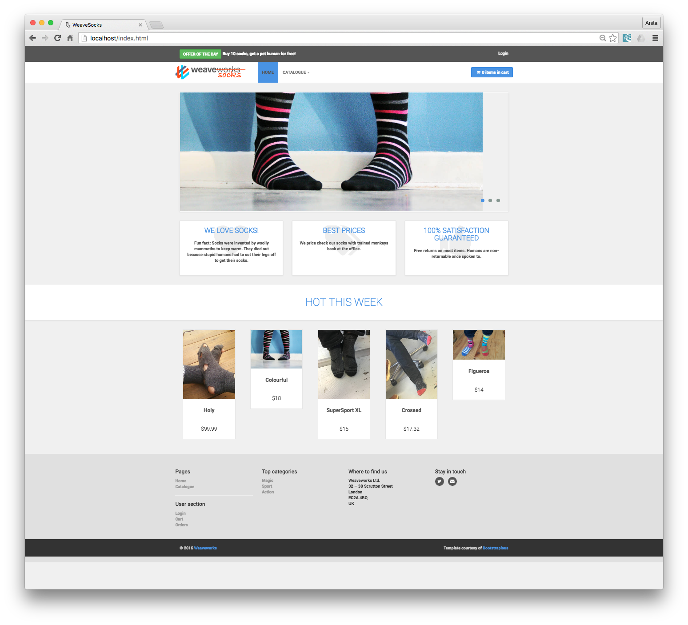

{{ include "./includes/parts.md" }}

In Part 1 of this series, you'll use Weave Cloud to validate and troubleshoot your app on a development laptop and then compare it with a production environment.

In parts 3 to 4, you'll learn how to set up Flux to achieve [continuous delivery][part2] and [how to monitor applications running in the cloud Prometheus][part3].

In Part 4 you will [secure your app using Kubernetes Network policy and then eforce it with Weave Net][part4].

All four of these tutorials use the Weaveworks microservices app, [The Sock Shop](https://github.com/microservices-demo).

### About Part 1

In this tutorial you will use the Weaveworks sample app, [The Sock Shop](https://github.com/microservices-demo), deploy it to three Ubuntu hosts, running Docker and Kubernetes and networked with Weave Net. Then you'll validate and troubleshoot any issues with it in Weave Cloud.

This tutorial takes approximately 25 minutes to complete.

[[ open_div \`style='width:50%; padding: 10px; float:right; text-align:right; font-weight:700;'\` ]]

[Go to next part: Part 2 – Deploy: Continuous Delivery &raquo;][part2]

[[ close_div ]]

## A Video Overview

  

    <iframe src="https://player.vimeo.com/video/190563578" width="640" height="360" frameborder="0" webkitallowfullscreen mozallowfullscreen allowfullscreen></iframe>
  

## What You Will Use

 * [Weave Cloud](https://cloud.weave.works)
 * [Docker for Mac](https://docs.docker.com/docker-for-mac/docker-toolbox/)
 * [Weaveworks Microservices Demo (Sock Shop)](https://github.com/microservices-demo)
 * [Kubernetes](http://kubernetes.io/)
 * [Weave Net](https://www.weave.works/products/weave-net/)

<!-- TODO deduplicate this wrt the docker for mac guide... -->

## Before You Begin

Ensure the following installed are installed before you begin:

 * [Git](http://git-scm.com/downloads)
 * [Docker](https://docs.docker.com/engine/installation/) and [Docker Compose](https://docs.docker.com/compose/install/)
   * Note that this guide also works with [Docker for Mac](https://docs.docker.com/docker-for-mac/)

## If You're on a Mac

If you haven't installed Docker for Mac before, follow the installation instructions on <a href="https://docs.docker.com/docker-for-mac/" target="_blank">Docker website </a>.

Once it's running you will see  in your menu bar.

## Sign Up for Weave Cloud

To begin, sign up for Weave Cloud and deploy the Scope probe on your laptop.

After verifying that the app works as it should on your laptop, you'll launch a new set of Scope probe in to your production environment, launch the app and Kubernetes and compare that deployment with the one on your laptop.

To sign up for Weave Cloud:

1.  Go to <a href="https://cloud.weave.works" target="_blank"> Weave Cloud </a>
2.  Sign up using either a Github, or Google account or use an email address.
3.  Obtain the cloud service token from the User settings screen:

### Launch the Scope Probe on Your Laptop

Launch the Scope probe using the token you obtained when you signed up for the service:

<!-- TODO maybe this should use the k8s scope yaml in the launcher -->

~~~bash
curl --silent --location https://git.io/scope --output /usr/local/bin/scope
sudo chmod +x /usr/local/bin/scope
scope launch --service-token=<YOUR_WEAVE_CLOUD_SERVICE_TOKEN>
~~~

**Where,**

* `<YOUR_WEAVE_CLOUD_SERVICE_TOKEN>` - is the token that appears on the settings page, once you’ve logged into Weave Cloud.

## Deploying the Socks Shop

To deploy The Socks Shop to your local machine:

**1. Get the code:**

~~~bash
git clone https://github.com/microservices-demo/microservices-demo.git
~~~

**2. Change into the following directory:**

~~~bash
cd microservices-demo/deploy/docker-compose
~~~

**3. Run the Sock Shop and display it in your browser:**

~~~bash
docker-compose up -d
~~~

**Note:** If the shop doesn't come up right away or it gives you an error like `ERROR: for edge-router  Cannot start service edge-router:` because of a port in use, try going to `http://127.0.0.1` in your browser.

### Run a Load Test on the Sock Shop

To fully appreciate the topology of this app in Weave Scope (the graph of your containers visible in Weave Cloud), you will need to run a load on the app.

Run a load test with the following:

~~~bash
docker run -ti --rm --name=LOAD_TEST \
  --net=dockercompose_default \
  weaveworksdemos/load-test -h edge-router -r 100 -c 2
~~~

With the load test running, observe the different services communicating by clicking on the Load Test container in Weave Cloud. From the metrics panel, open the load test's terminal to view the messages. With the load test running, the topology in Weave Cloud will also begin to form where you can see the microservices communicating with one another in the app.

# Deploying the app to "production" on Kubernetes

{{ include "./includes/setup-kubernetes-sock-shop.md" }}

## Tear Down on Ubuntu

<!-- TODO this should probably say "on Digital Ocean" -->

{{ include "./includes/setup-kubernetes-sock-shop-teardown.md" }}

## Tear Down on Your laptop

To remove the Sock Shop from your laptop, run the following:

~~~bash
docker-compose down
~~~

## Conclusions

In this tutorial you learned how to verify an app deployed to your laptop with the same tools (Weave Scope) used when your app is deployed to a Kubernetes cluster.

{{ include "./includes/slack-us.md" }}

[[ open_div \`style='width:50%; padding: 10px; float:right; text-align:right; font-weight: 700;'\` ]]

[Go to next part: Part 2 – Deploy: Continuous Delivery &raquo;][part2]

[[ close_div ]]
