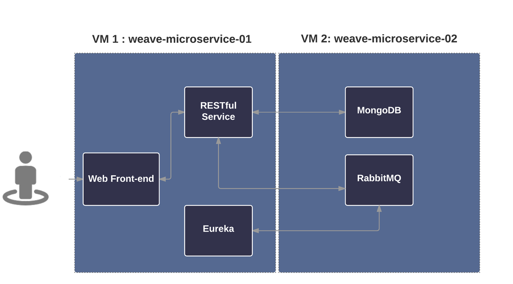
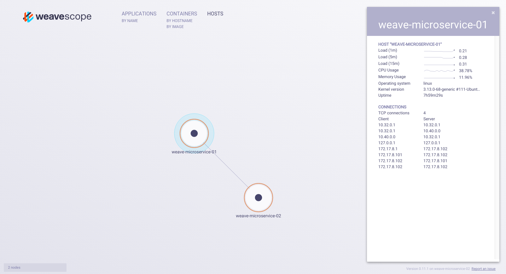
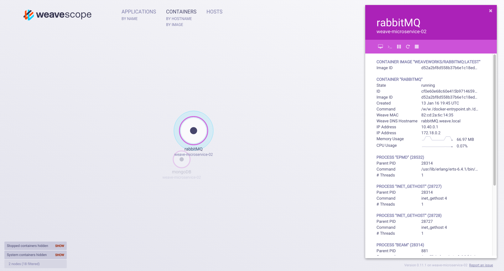
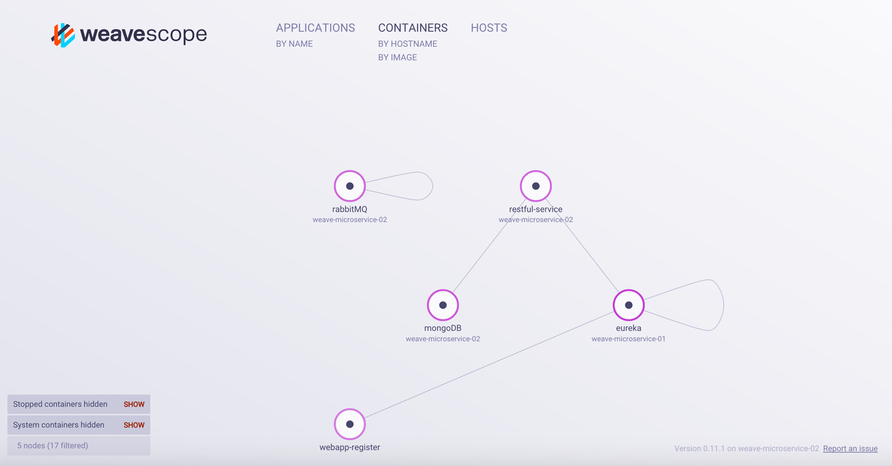
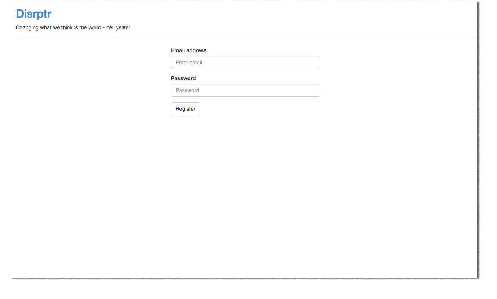

**Note:** You are looking at our `old-guides` repository. The guides in here haven't been updated in a while.
They might or might not work for you. We are keeping them around for informational purposes.

---

Spring Boot is a framework that allows you to build stand-alone production grade applications. Since [Spring Boot](http://projects.spring.io/spring-boot/) services are relatively isolated and are generally designed to perform one function, the framework lends itself well to a microservices-based architecture.

This guide shows you how to network and monitor a containerized user registration application based on a microservices architecture. You will run several microservices in docker containers, deploy them across two VMs, connect them all together with Weave Net, and then use Weave Scope to monitor the microservices and to troubleshoot and verify the application as its being deployed.

The application built in this example is a user registration management system. Users register through a web front-end by entering an email and an associated password.

The backend user registration service exposes a single RESTful endpoint for registering users. The registration request contains the user’s email address and password, which is sent to the Mongo database, and if the email address is not already present, it notifies [RabbitMQ,](https://www.rabbitmq.com/download.html) who then notifies [Eureka](https://github.com/netflix/eureka) (an Open Source Registration service developed by Netflix) to include it in the registry. 

The code used in this example is adapted from Chris Richardson's excellent discussion and tutorial on microservices architecture. For information on how this application is built, see [**Building microservices with Spring Boot – part 1**](http://plainoldobjects.com/2014/04/01/building-microservices-with-spring-boot-part1/) and [**Building Microservices with Spring Boot --part 2**](http://plainoldobjects.com/2014/05/05/building-microservices-with-spring-boot-part-2/)

A Vagrant file is provided for convenience. This script provisions two Ubuntu Virtual Machines (VMs) on VirtualBox and downloads all of the necessary container images.

This guide requires no programming, and depending on the speed of your network, will take about 20 minutes to complete. 

## What You Will Use

* [Weave](http://weave.works)
* [Weave Scope](http://weave.works/scope/index.html)
* [Docker](http://docker.com)
* [Spring Boot](http://projects.spring.io/spring-boot/)
* [Netflix/Eureka](https://github.com/netflix/eureka)
* [RabbitMQ](https://www.rabbitmq.com/download.html)
* [Mongo NoSQL Database](https://www.mongodb.org/)

## Before You Begin

Ensure that the following are installed and configured for your operating system before you start:

* [Vagrant]( https://docs.vagrantup.com/v2/installation/)
* [Virtualbox]( https://www.virtualbox.org/)

## Getting The Code

To begin this guide, clone the git directory and cd to the `spring-boot-weave-microservices` directory:

~~~bash
git clone https://github.com/weaveworks/guides

cd spring-boot-weave-microservices
~~~

## Setting Up The Virtual Machines and Pulling the Docker Images

The Vagrant script provisions two VMs with Ubuntu on VirtualBox, installs the latest version of Docker and Weave Net and also downloads (or pulls) the necessary docker images used in this guide. 

Change to the `spring-boot-weave-microservices` directory, and run the vagrant script: 

~~~bash
vagrant up
~~~

After the script is complete, view the status of the VMs: 

~~~bash
vagrant status
~~~

where you should see the following: 

~~~bash
weave-microservice-02     running (virtualbox)
weave-microservice-01     running (virtualbox)
~~~

The IP Addresses used for the two VMs are: 

weave-microservice-01: 172.17.8.102

weave-microservice-02: 172.17.8.101

## Launching a Weave Container Network and Peering The Virtual Machines

Next, launch Weave Net onto both VMs, and create a peer connection between the two by passing the IP address of one VM to the other VM. 

ssh onto `weave-microservice-01`: 

~~~bash
vagrant ssh weave-microservice-01
~~~

And then launch Weave Net: 

~~~bash
vagrant@weave-microservice-01:~$ weave launch
~~~

Set the environment for Weave: 

~~~bash
vagrant@weave-microservice-01:~$ eval $(weave env)
~~~

Now do the same for the other VM, but this time pass the IP of `weave-microservices-01` to `weave-microservice-02` during `weave launch`. 

In a new terminal window:

~~~bash
vagrant ssh weave-microservice-02
~~~

Launch Weave Net onto the VM: 

~~~bash
vagrant@weave-microservice-02:~$ weave launch 172.17.8.102
~~~

Set the environment for Weave Net: 

~~~bash
vagrant@weave-microservice-02:~$ eval $(weave env)
~~~

>**Important!** If you exit the VM terminal and then return to it, remember to restore Weave's environment. You can do this by running: `weave env --restore` 

Check that the VMs are peered: 

~~~bash

vagrant@weave-microservice-01:~$ weave status

        Version: 1.4.3

        Service: router
       Protocol: weave 1..2
           Name: 4e:fa:13:6e:48:c7(weave-microservice-01)
     Encryption: disabled
  PeerDiscovery: enabled
        Targets: 0
    Connections: 1 (1 established)
          Peers: 2 (with 2 established connections)
 TrustedSubnets: none

        Service: ipam
         Status: ready
          Range: 10.32.0.0-10.47.255.255
  DefaultSubnet: 10.32.0.0/12

        Service: dns
         Domain: weave.local.
       Upstream: 10.0.2.3
            TTL: 1
        Entries: 3

        Service: proxy
        Address: unix:///var/run/weave/weave.sock

        Service: plugin
     DriverName: weave
~~~

## Launching Weave Scope

Next install `Weave Scope` and use it to view your microservices application as it deploys onto the Weave Network.  

For `Weave Scope` to monitor all containers, the application must be installed and launched onto both VMs.

On `weave-microservice-01` VM install and launch Weave Scope:
 
~~~bash
sudo wget -O /usr/local/bin/scope \
  https://github.com/weaveworks/scope/releases/download/latest_release/scope
sudo chmod a+x /usr/local/bin/scope
sudo scope launch
~~~

Now switch to the terminal of `weave-microservice-02` and do the same . 

Display `Weave Scope` in your browser using the URL that was presented to you in the terminal window after the application has finished launching. In this guide, Scope uses the following URLs: `http://172.17.8.101:4040/` or `http://172.17.8.102:4040/`

## Viewing Peered Virtual Machines in Weave Scope

With both `Weave Net` and `Weave Scope` launched, go to `Weave Scope`in your browser to view the peered VMs. A line between the two nodes indicates a connection has been made, and if you mouse over one of the nodes all connections with that node highlight. You will see a better example of this highlighting once the entire microservices application has been deployed. 

You can use `Weave Scope` to monitor the communications of the different microservices as they are being deployed throughout this guide. 

## Deploying the Microservices to Docker Containers

The microservices are divided between the VMs. On `weave-microservice-01`, the docker images for the web front-end services as well as the registration manager were downloaded. 

These include: 

 * Restful Service
 * The Web App
 * Eureka

And on `weave-microservices-02` the images for the back-end services were downloaded: 

 * RabbitMQ
 * MongoDB

### Deploying Containers onto weave-microservice-02

First, deploy the backend microservices onto `weave-microservice-02`. 

An explanation of the docker run commands is beyond the scope of this guide. For more information on their use, refer to [Docker Run Commands documentation](https://docs.docker.com/engine/reference/commandline/run/)

>**Note:** Before running the docker commands, ensure that the weave environment is set. If you have left the terminal, you must enter `weave env --restore` before attaching the containers to the Weave Network.

To deploy the containers onto `weave-microservice-02` run the following docker commands for each service from the `weave-microservice-02` terminal window: 

**RabbitMQ Service**

~~~bash
docker run -d --name=rabbitMQ weaveworks/rabbitmq /docker-entrypoint.sh rabbitmq-server
~~~

**mongoDB Service** 

~~~bash
docker run -d --name=mongoDB weaveworks/mongo /entrypoint.sh mongod --smallfiles
~~~

### Viewing the RabbitMQ and MondoDB Containers in Scope

Go back to Weave Scope in your browser to visualize and view metrics about the recently deployed services. As you can see, the Mongo database, and RabbitMQ are standing by and waiting for instructions. They are not in communication yet because neither the Eureka (the User Management Service) nor the Restful Services have been deployed.

Click on the RabbitMQ container to view its metrics:

### Deploying Containers onto weave-microservice-01

Return to the `weave-microservice-01` terminal and deploy the RESTful service, the Web App and the Eureka service into containers.

**Eureka Service**

~~~bash
docker run -d --name=eureka weaveworks/eureka java -jar /app.jar
~~~

**Restful Service**

~~~bash
docker run -d --name=restful-service weaveworks/microservice_apps java -DSPRING_RABBITMQ_HOST=rabbitmq -Dspring.data.mongodb.uri=mongodb://mongodb/userregistration -jar /app/spring-boot-restful-service.jar --spring.profiles.active=enableEureka --eureka.client.serviceUrl.defaultZone=http://eureka:8761/eureka/
~~~

**The Web App**

~~~bash
docker run -d -p 8080:8080 --name=webapp-register weaveworks/microservice_apps java -Duser_registration_url=http://REGISTRATION-SERVICE:8081/user -jar /app/spring-boot-webapp.jar --spring.profiles.active=enableEureka --eureka.client.serviceUrl.defaultZone=http://eureka:8761/eureka/
~~~

After launching the containerized front-end services, and Eureka, return to `Weave Scope`, where you can visualize and monitor the microservices discovering each other. Once discovery is complete, all of the microservices should be connected with one another. Mouse over a container node to see its connections, which are indicated by other nodes highlighting.

>Note: RabbitMQ may not be connected right away. It connects when the first registration request has been made, which is illustrated in a later section of this guide. 

### Viewing the DNS Entries with Weave

The containerized microservices were deployed onto Weave Net without making any changes to the code base and without having to link ports between containers. 

Weave Net automatically discovers containers on the network and adds a DNS entry using the name of the container and the `weave.local` domain to give any container on a weave network a fully qualified domain name. For example, mongoDB is referred to as: `mongoDB.weave.local`. 

To view the container DNS entries made by Weave: 

~~~bash
weave status dns
~~~

which if executed on `weave-microservices-01` shows the following: 

~~~bash
eureka       10.32.0.2       52f915802e92 4e:fa:13:6e:48:c7
mongoDB      10.40.0.2       77e4f19a9217 9e:e7:55:5a:ec:70
rabbitMQ     10.40.0.1       cf0e60e68c60 9e:e7:55:5a:ec:70
restful-service 10.32.0.3    21347514dedb 4e:fa:13:6e:48:c7
scope        10.0.2.15       e49020094d92 4e:fa:13:6e:48:c7
scope        10.32.0.1       e49020094d92 4e:fa:13:6e:48:c7
scope        172.17.8.102    e49020094d92 4e:fa:13:6e:48:c7
scope        10.0.2.15       a96b8ea7a154 9e:e7:55:5a:ec:70
scope        10.40.0.0       a96b8ea7a154 9e:e7:55:5a:ec:70
scope        172.17.8.101    a96b8ea7a154 9e:e7:55:5a:ec:70
webapp-register 10.32.0.4    a2c19c69fe45 4e:fa:13:6e:48:c7 
~~~

## Visualizing User Registration with Weave Scope

With the containers deployed, and all in communication, you are ready to test the application.  Open the following URL in your browser: `http://127.0.0.1:8080/register.html` to display the registration page.

To ensure that your message reached the correct destination, display `Weave Scope`, click on the RESTful Service container, and then open the terminal view. The terminal view is launched by clicking the control button furthest left.

Enter an email address and a password into the registration page, and then wait for the message to appear in the Terminal View of the RESful Service container displayed in Weave Scope.  Notice that the RESTful service has processed and passed on the message to the system. 

Display the terminal window of other containers, and then add a new email to see what messages appear. 

>**Note:** You can also stop, pause and restart containers to troubleshoot communication errors in your app. 

## Cleaning up the VMs

To clean up the VMs from your machine: 

~~~bash
vagrant destroy
~~~

## Conclusions

You have used Weave Net to network a containerized microservices-based application distributed across two VMs. You also used Weave Scope to visualize and monitor the micoservices as they were being deployed and used it to test interactions within your application. 

Thank-you to Chris Richardson, who graciously lent us the use of his code. For more information on this application and on microservices in general, see Chris Richardson's blog, [Plain Old Objects](http://plainoldobjects.com/)

## Further Reading

* [Documentation Home Page](/docs)
* [Weave Features](/docs/latest/features/)
* [Weave encryption](/docs/latest/features/#security)
* [WeaveDNS](/docs/net/latest/weavedns/)
