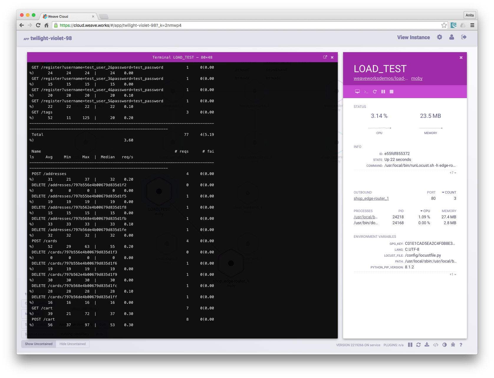

In this guide you will learn how Weave Cloud can help you understand and troubleshoot a microservices-based app.  The app you will deploy is an online store, called the Socks Shop that consists of several microservices written in three different languages: Node.js, Spring Boot and Go Kit, and which also uses the data services, RabbitMQ and MongoDB.

You will use Docker and Docker Compose to deploy the Socks Shop onto your local machine, and then you will launch Weave Scope probes to push metrics to Weave Cloud so that you can observe the topology of the app and explore how it works. Weave Scope probes monitor network traffic and builds a topology graph in real-time. The view in Weave Cloud is augmented with metadata from the Docker API along with several different systems metrics that allow you to troubleshoot your app.

The following topics are discussed: 

* [Installing Docker for Mac](#install-docker-for-mac)
* [Deploying the Socks Shop App](#deploy-the-demo-app)
* [Signing Up for Weave Cloud](#sign-up-to-weave-cloud)
* [Connecting the Scope Probes to Weave Cloud](#connect-scope-probe-to-weave-cloud)


<h3 id="install-docker-for-mac">Installing Docker for Mac</h3>

If you haven't installed Docker for Mac, please follow the installation instructions on [Docker website][install-d4m].

Once it's running you will see  in your menu bar.

[install-d4m]: https://docs.docker.com/docker-for-mac/

<h3 id="deploy-the-demo-app">Deploying the Socks Shop App</h3>

To deploy The Socks Shop: 

**1. Get the code:**

```
git clone https://github.com/weaveworks/guides
cd microservices-demo-app
```

**2. Deploy Weave Net and the Socks Shop app:**

```
docker-compose pull 
docker-compose -p shop up -d 
open http://localhost
```

>>**Note: Since the app is written in Java, you may have to wait from 6 to 10 minutes for the app to appear in your browser. 

Once the app  displays in your browser, you can test the functionality. Login using `user1`/`password1`, and then put an item in the basket and proceed to checkout.


[demo-app]: https://github.com/weaveworks/weaveDemo


<h3 id="sign-up-to-weave-cloud">Signing Up for Weave Cloud</h3>

To visualize microservices, first sign up for Weave Cloud:

1.	Go to [cloud.weave.works](https://cloud.weave.works)
2.	Sign up using either a Github, or Google account or you can use an email address.
3.	Obtain the cloud service token from the User settings screen:


<h3 id="connect-scope-probe-to-weave-cloud">Connecting the Scope Probes to Weave Cloud</h3>

Install and launch the Weave Scope probes:

```
sudo curl --silent --location https://git.io/scope --output /usr/local/bin/scope
sudo chmod +x /usr/local/bin/scope
scope launch --service-token=<YOUR_WEAVE_CLOUD_SERVICE_TOKEN>
```

**Where,** 

`=<YOUR_WEAVE_CLOUD_SERVICE_TOKEN>` - is the token that appears on the settings page, once you’ve logged into Weave Cloud. 


<h3 id="run-the-load-test">Running the Load Test</h3>

To fully appreciate the topology of this app, you will need to run a load on the app. 

Run a load test with the following:

```
docker run -ti --rm --name=LOAD_TEST \
  --net=shop_external \
  weaveworksdemos/load-test -h edge-router -r 100 -c 2
```

With the load test running, you can observe the different services communicating by clicking on the Load Test container in Weave Cloud. Then open its associated terminal to view the test's messages. With the load test running, the topology graph in Weave Cloud console will also form.



###Tearing Down the App

To clean up the app from system: 

```
docker-compose -p shop down
```

###Conclusions

In this guide, an online store using a microservices-based approach was launched into the Weave Cloud, where you could observe communication events and also interact with the topology of the microservices app. 

If you have any questions or comments, we would be happy to hear from you, visit [Weave Help & Support](https://www.weave.works/help/) for information on ways to contact us. 

**Further Reading**

 * [Introducing Weave Cloud](https://www.weave.works/docs/scope/latest/introducing/)
 * [Installing Weave Scope](https://www.weave.works/docs/scope/latest/installing/)


