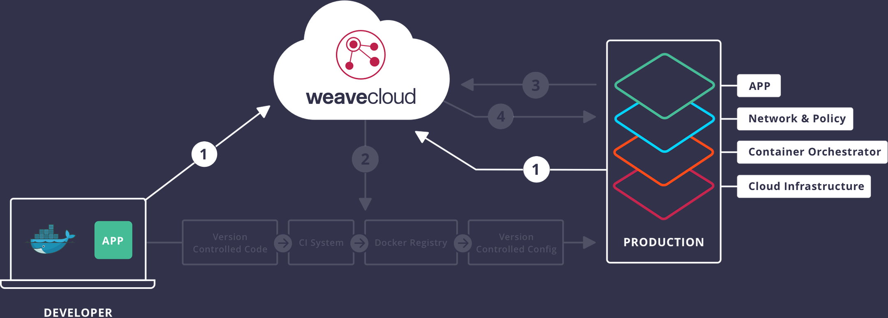

<!-- Setup: Troubleshooting Dashboard with Weave Cloud and Weave Scope -->

This is Part 1 of 4 of the <a href="/guides/">Weave Cloud guides series</a>. In this part, we'll see how to set up, verify and troubleshoot your app with Weave Cloud and Weave Scope.
* We'll start on your local laptop using Docker Compose in development.
* Then we'll see how to set up Kubernetes for production, including Weave Net, and then deploy your application to it.

<a href="/guides/cloud-guide-part-2-deploy-continuous-delivery/">Go to next part: Part 2 – Deploy: Continuous Delivery &raquo;</a>

<iframe width="530" height="298" src="https://www.youtube.com/embed/6fb-dmrKTOU?modestbranding=1&autohide=0&showinfo=0&controls=1&rel=0" frameborder="0" allowfullscreen></iframe>

## Contents

{"gitdown": "contents"}

## Set up

In this four-part tutorial how to deploy, deliver, and monitor a secure microservices Cloud Native app is described.

To streamline your app development pipeline and make your app Cloud Native to develop code faster, the following will be incorporated:

* A microservices-based architecture
* Docker Containers
* Continuous Integration and Delivery
* Kubernetes container orchestration

A Cloud Native app gives you the freedom to focus on your code instead of maintaining cloud tools, where rapid, incremental updates can be made without having to disassemble and reassemble your infrastructure each time a new feature is added.  And while the ability to rapidly deploy changes to your app is important, the freedom to choose your own source control system, deployment tools and container registry without having to maintain a set of custom scripts is also critical.

With Weave Cloud you can view and monitor your microservices all in one place in a convenient troubleshooting dashboard, and together with automated continuous delivery built with your favorite tools, Weave Cloud allows you to create higher quality code more rapidly.

You will use the Weaveworks sample app, [The Sock Shop](https://github.com/microservices-demo), deploy it to a couple of virtual machines running Docker and Kubernetes and then verify and troubleshoot any issues in Weave Cloud.

Specifically, in this tutorial, you will:

1. Set up Docker or Docker for Mac on your local machine (if you haven't already done so).
2. Deploy the sock shop with Docker Compose.
3. Install Scope and verify your app that's running on your laptop in Weave Cloud.
3. Configure a Kubernetes cluster and at the same time install Weave Net onto Digital Ocean.
4. Use Weave Cloud to watch the Kubernetes cluster deployment in Digital Ocean.
5. Install the Sock Shop onto Kubernetes.
5. Compare both apps, on your laptop and in the Kubernetes cluster on Digital Ocean, using Weave Scope in Weave Cloud.

This tutorial will take approximately 15 minutes to complete.

## What You Will Use

* [Weave Cloud](https://cloud.weave.works)
* [Docker for Mac](https://docs.docker.com/docker-for-mac/docker-toolbox/)
* [Weaveworks Sockshop](https://github.com/microservices-demo)
* [Kubernetes](http://kubernetes.io/)
* [Weave Net](https://www.weave.works/products/weave-net/)

<!-- TODO deduplicate this wrt the docker for mac guide... -->

## Before You Begin

Ensure that you have the following installed:

* [Git](http://git-scm.com/downloads)
* [Docker](https://docs.docker.com/engine/installation/) and [Docker Compose](https://docs.docker.com/compose/install/)
  * Note that this guide also works with [Docker for Mac](https://docs.docker.com/docker-for-mac/)

## If you're on a Mac

If you haven't installed Docker for Mac before, follow the installation instructions on <a href="https://docs.docker.com/docker-for-mac/" target="_blank">Docker website </a>. <!-- lkj_ -->

Once it's running you will see  in your menu bar.

## Sign Up for Weave Cloud

Next, use Weave Cloud to verify what was just deployed to your laptop and check that everything deployed correctly and that all services are behaving as they should. You will verify the app first on your laptop. Then you'll use Weave Cloud to view the Kubernetes pods as they get deployed, and again to verify the Sock Shop after it gets deployed to Kubernetes in Digital Ocean.

To check that everything installed correctly on your laptop, first sign up for Weave Cloud:

1.  Go to <a href="https://cloud.weave.works" target="_blank"> Weave Cloud </a> <!-- lkj_ -->
2.  Sign up using either a Github, or Google account or use an email address.
3.  Obtain the cloud service token from the User settings screen:

### Launch the Weave Cloud Probes

Launch the Weave Cloud probes using the token you obtained when you signed up for Weave Cloud:

<!-- TODO maybe this should use the k8s scope yaml in the launcher -->

~~~bash
curl --silent --location https://git.io/scope --output /usr/local/bin/scope
sudo chmod +x /usr/local/bin/scope
scope launch --service-token=<YOUR_WEAVE_CLOUD_SERVICE_TOKEN>
~~~

**Where,**

* `<YOUR_WEAVE_CLOUD_SERVICE_TOKEN>` - is the token that appears on the settings page, once you’ve logged into Weave Cloud.

**Note:** To set the Weave Cloud controls to read-only for all users, you can launch scope with the `--probe.no-controls` flag.  In this demo, you will be launching a terminal window and viewing messages between microservices, and so this flag is not necessary. However, you may want to keep this flag in mind when using Weave Cloud and sharing your infrastructure views with others outside of your organization.

Weave Cloud controls allow you to stop, start and pause containers. They also enable you to launch a terminal and interact directly with your containers.

## Deploying the Socks Shop

To deploy The Socks Shop:

**1. Get the code:**
~~~
git clone https://github.com/microservices-demo/microservices-demo.git
~~~

**2. Change into the right directory in the repo you just cloned:**

<!-- XXX this doesn't work any more :/ -->

~~~
cd microservices-demo/deploy/docker-only
~~~

**3. Run the Sock Shop and display it in your browser:**

~~~
docker-compose up -d
~~~

**Note:** If the shop doesn't come up right away or it gives you an error like `ERROR: for edge-router  Cannot start service edge-router:` because of a port in use, try going to `http://127.0.0.1` in your browser.

### Run a Load Test on the Sock Shop

To fully appreciate the topology of this app in Weave Scope (the graph of your containers visible in Weave Cloud), you will need to run a load on the app.

Run a load test with the following:

~~~bash
docker run -ti --rm --name=LOAD_TEST \
  --net=shop_external \
  weaveworksdemos/load-test -h edge-router -r 100 -c 2
~~~

With the load test running, you can observe the different services communicating by clicking on the Load Test container in Weave Cloud. From the metrics panel, open the load test's terminal to view the messages. With the load test running, the topology graph in Weave Cloud console will also form.

# Deploying the app to "production" on Kubernetes

{"gitdown": "include", "file": "./includes/setup-kubernetes-sock-shop.md"}

## Tear Down

{"gitdown": "include", "file": "./includes/setup-kubernetes-sock-shop-teardown.md"}

## Conclusions

In this tutorial you learned how to verify your app deployed to your laptop with the same tools (Weave Scope) that you can use when your app is deployed to a Kubernetes cluster. The next next part of this series discusses how to configure "Continuous Delivery with Weave Cloud".

<a href="/guides/cloud-guide-part-2-deploy-continuous-delivery/">Go to next part: Part 2 – Deploy: Continuous Delivery &raquo;</a>

{"gitdown": "include", "file": "./includes/slack-us.md"}
