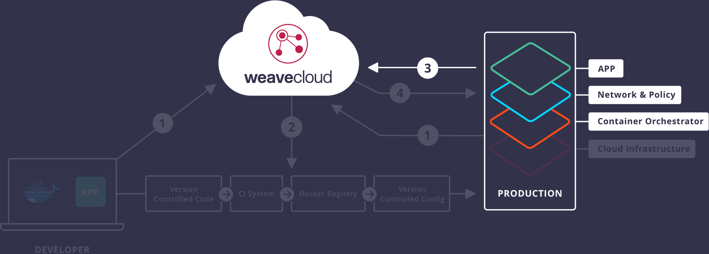

# Monitor: Prometheus Monitoring with Weave Cortex

This is Part 3 of 4 of the <a href="/guides/">Weave Cloud guides series</a>.
In this guide we'll see how to configure Cloud Native Monitoring with Weave Cloud and Weave Cortex, and view your app's metrics in the Weave Cloud monitoring dashboard. This example uses Kubernetes.

<a href="/guides/cloud-guide-part-2-deploy-continuous-delivery/">&laquo; Go to previous part: Part 2 – Deploy: Continuous Delivery</a>

<a href="/guides/cloud-guide-part-4-secure-container-firewalls/">Go to next part: Part 4 – Secure: Container Firewalls &raquo;</a>

VIDEO GOES HERE

## Contents

{"gitdown": "contents"}

## Introduction

Microservices environments by nature are dynamic and are in a state of constant change especially if they are running inside containers. They may also be spread across multiple clouds or they may be spanning both a data center and a cloud which can make monitoring a challenge.  And since these systems tend to be in a state of constant change with containers going down and spinning back up again, traditional monitoring systems which are typically server-focused, don't work well with dynamic systems.

Weave Cortex is built upon the open source project, Prometheus and it sits in your Kubernetes cluster and listens for changes throughout the entire pod regardless of where they may physically lie within a single Kubernetes cluster or even across a Kubernetes federation. Once Weave Cortex is deployed to your Kubernetes production environment, metrics are automatically pushed to Weave Cloud where they can be viewed and queried from within the Microservices Dashboard.

You will use the sample app, 'The Sock Shop', deploy it to a couple of virtual machines running Docker and Kubernetes and then monitor issues in Weave Cloud.

Specifically, in this tutorial, you will:

1. Sign up for Weave Cloud and obtain a Weave Cloud token.
2. Configure a Kubernetes cluster and at the same time install Weave Net onto two Ubuntu hosts.
4. Use Weave Cloud to observe the Kubernetes cluster deployment.
5. Install the Sock Shop onto the Kubernetes cluster.
5. Configure and launch the Cortex agent to start pushing metrics to Weave Cloud
6. Run a load test on the Sock Shop and view the metrics in Weave Cortex from the Weave Cloud troubleshooting dashboard.

This tutorial will take approximately 15 minutes to complete.

This guide contains the following topics:

 * [What You Will Use](#what)
 * [Installing Docker for Mac](#installing-mac)
 * [Sign Up for Weave Cloud](#weave-cloud)
 * [Set Up Droplets in Digital Ocean](#do-droplets)
     * [Create two Ubuntu Instances](#ubuntu)
     * [Adding an Additional Instance to Weave Cloud](#add-instance)
 * [Set Up a Kubernetes Cluster](#kubernetes)
     * [Objectives](#objectives)
     * [Installing kubelet and kubeadm on Your Hosts](#kubeadm-hosts)
     * [Initializing the Master](#master)
     * [Installing Weave Net](#weave-net)
     * [Joining Your Nodes](#join-nodes)
     * [(Optional) Control Your Cluster From Machines Other Than the Master](#cluster-other-machine)
     * [Installing the Sock Shop onto Kubernetes](#demo-kubernetes)
     * [Viewing the Sock Shop in Your Browser](#view-browser)
     * [Configuring Cortex for Your Production Environment](#cortex)
     * [Run the Load Test on the Cluster](#load-test-cluster)
     * [Viewing Sock Shop Metrics in Weave Cortex](#metrics-cortex)
     * [Running Queries with the Prometheus Query Language](#queries-cortex)
     * [Limitations](#limitations)
     * [Tear Down](#tear-down)
     * [Recreating the Cluster: Starting Over](#recreate-cluster)
     * [Conclusions](#conclusion)

##What You Will Use

* [Weave Cloud](https://cloud.weave.works)
* [Kubernetes](http://kubernetes.io/)
* [Weaveworks Sockshop](https://github.com/microservices-demo)
* [Weave Net](https://www.weave.works/products/weave-net/)

##Sign Up for Weave Cloud

Before you can use Cortex to monitor apps, you will need to sign up for a Weave Cloud account.

1.  Go to <a href="https://cloud.weave.works" target="_blank"> Weave Cloud </a>
2.  Sign up using either a Github, or Google account or use an email address.
3.  Make a note of the cloud service token from the User settings screen:

**Note:** If you are continuing on from the previous example you can use your Cloud token to set up Prometheus Monitoring below.

##Set Up Droplets in Digital Ocean

Sign up for [Digital Ocean]( and create two Ubuntu instances, where you'll deploy a Kubernetes cluster, add a container network using Weave Net and finally deploy the Sock Shop onto the cluster and verify this deployment with the one you just did on your laptop in Weave Cloud.

**Note:** It is recommended that each host have at least 4 gigabytes of memory in order to run this demo smoothly.

###Create Two Ubuntu Instances in Digital Ocean

Next you'll move over to Digital Ocean and create two Ubuntu droplets Both machines should run Ubuntu 16.04
with 4GB or more of RAM per machine.

This example uses Digital Ocean, but you can just as easily create these two instances in AWS or on whoever your favourite cloud provider is.

<h3 id="sign-up-to-weave-cloud">Adding an Additional Instance to Weave Cloud</h3>

Before you start installing Kubernetes, create an additional instance in Weave Cloud. This extra instance assists you when you're deploying Kubernetes and will also allow you to see the Sock Shop as it spins up on Kubernetes.  

Select the 'Create New Instance' command located in the menu bar.

##Set up a Kubernetes Cluster

This is by far the simplest way in which to install Kubernetes.  In a few commands, you will have deployed a complete Kubernetes cluster with a resilient and secure container network onto the Cloud Provider of your choice.

The installation uses a tool called `kubeadm` which is part of Kubernetes 1.4.

This process works with local VMs, physical servers and/or cloud servers.
It is simple enough that you can easily integrate its use into your own automation (Terraform, Chef, Puppet, etc).

See the full [`kubeadm` reference](/docs/admin/kubeadm) for information on all `kubeadm` command-line flags and for advice on automating `kubeadm` itself.

**The `kubeadm` tool is currently in alpha but please try it out and give us [feedback](/docs/getting-started-guides/kubeadm/#feedback)!
Be sure to read the [limitations](#limitations); in particular note that kubeadm doesn't have great support for
automatically configuring cloud providers.  Please refer to the specific cloud provider documentation or
use another provisioning system.**

kubeadm assumes you have a set of machines (virtual or real) that are up and running.  It is designed
to be part of a larger provisioning system - or just for easy manual provisioning.  kubeadm is a great
choice where you have your own infrastructure (e.g. bare metal), or where you have an existing
orchestration system (e.g. Puppet) that you have to integrate with.

###Objectives

* Install a secure Kubernetes cluster on your machines
* Install a pod network on the cluster so that application components (pods) can talk to each other
* Install a sample microservices application (a socks shop) on the cluster
* View the result in Weave Cloud as you go along

###Installing kubelet and kubeadm on Your Hosts

You will install the following packages on all the machines:

* `docker`: the container runtime, which Kubernetes depends on. v1.11.2 is recommended, but v1.10.3 and v1.12.1 are known to work as well.
* `kubelet`: the most core component of Kubernetes.
  It runs on all of the machines in your cluster and does things like starting pods and containers.
* `kubectl`: the command to control the cluster once it's running.
  You will only need this on the master, but it can be useful to have on the other nodes as well.
* `kubeadm`: the command to bootstrap the cluster.

For each host in turn:

* SSH into the machine and become `root` if you are not already (for example, run `sudo su -`):

~~~
# curl -s https://packages.cloud.google.com/apt/doc/apt-key.gpg | apt-key add -
# cat <<EOF > /etc/apt/sources.list.d/kubernetes.list
deb http://apt.kubernetes.io/ kubernetes-xenial main
EOF
# apt-get update
# # Install docker if you don't have it already.
# apt-get install -y docker.io
# apt-get install -y kubelet kubeadm kubectl kubernetes-cni
~~~

**Note:**  You may have to re-run `apt-get update` and then run `apt-get install -y kubelet kubeadm kubectl kubernetes-cni` second time to ensure that the packages are properly downloaded.

###Initializing the Master

The master is the machine where the "control plane" components run, including `etcd` (the cluster database) and the API server (which the `kubectl` CLI communicates with).

All of these components run in pods started by `kubelet`.

Right now you can't run `kubeadm init` twice without turning down the cluster in between, see [Tear Down](#tear-down).

To initialize the master, pick one of the machines you previously installed `kubelet` and `kubeadm` on, and run:

     # kubeadm init

**Note:** this will autodetect the network interface to advertise the master on as the interface with the default gateway.

If you want to use a different interface, specify `--api-advertise-addresses=<ip-address>` argument to `kubeadm init`.

Please refer to the [kubeadm reference doc](/docs/admin/kubeadm/) if you want to read more about the flags `kubeadm init` provides.

This command downloads and installs the cluster database and the "control plane" components.
This may take several minutes.

The output should look like:

~~~
    <master/tokens> generated token: "f0c861.753c505740ecde4c"
    <master/pki> created keys and certificates in "/etc/kubernetes/pki"
    <util/kubeconfig> created "/etc/kubernetes/kubelet.conf"
    <util/kubeconfig> created "/etc/kubernetes/admin.conf"
    <master/apiclient> created API client configuration
    <master/apiclient> created API client, waiting for the control plane to become ready
    <master/apiclient> all control plane components are healthy after 61.346626 seconds
    <master/apiclient> waiting for at least one node to register and become ready
    <master/apiclient> first node is ready after 4.506807 seconds
    <master/discovery> created essential addon: kube-discovery
    <master/addons> created essential addon: kube-proxy
    <master/addons> created essential addon: kube-dns
~~~
~~~
    Kubernetes master initialised successfully!
    You can connect any number of nodes by running:
    kubeadm join --token <token> <master-ip>
~~~

Make a record of the `kubeadm join` command that `kubeadm init` outputs.
You will need this in a moment.

The key included here is secret, keep it safe &mdash; anyone with this key can add authenticated nodes to your cluster.

The key is used for mutual authentication between the master and the joining nodes.

By default, your cluster will not schedule pods on the master for security reasons.
If you want to be able to schedule pods on the master, for example if you want a single-machine Kubernetes cluster for development, run:

~~~
    # kubectl taint nodes --all dedicated-
    node "test-01" tainted
    taint key="dedicated" and effect="" not found.
    taint key="dedicated" and effect="" not found.
~~~

This will remove the "dedicated" taint from any nodes that have it, including the master node, meaning that the scheduler will then be able to schedule pods everywhere.

###Installing Weave Net

You must install a pod network so that your pods can communicate with each other.
In the meantime, the kubenet network plugin doesn't work. Instead, CNI plugin networks are supported, those you see below.

**You must add Weave Net before deploying any applications to your cluster and before `kube-dns` starts up.**

Install [Weave Net](https://github.com/weaveworks/weave-kube) by logging in to the master and running:

~~~
    # kubectl apply -f https://git.io/weave-kube
    daemonset "weave-net" created
~~~

**Note:** Install **only one** pod network per cluster.

Once a pod network is installed, confirm that it is working by checking that the `kube-dns` pod is `Running` in the output of `kubectl get pods --all-namespaces`.

And once the `kube-dns` pod is up and running, you can continue on to joining your nodes.

###Joining Your Nodes

The nodes are where your workloads (containers and pods, etc) run.
If you want to add any new machines as nodes to your cluster, for each machine: SSH to that machine, become root (e.g. `sudo su -`) and run the command that was output by `kubeadm init`.
For example:

~~~
    # kubeadm join --token <token> <master-ip>
    <util/tokens> validating provided token
    <node/discovery> created cluster info discovery client, requesting info from "http://138.68.156.129:9898/cluster-info/v1/?token-id=0f8588"
    <node/discovery> cluster info object received, verifying signature using given token
    <node/discovery> cluster info signature and contents are valid, will use API endpoints [https://138.68.156.129:443]
    <node/csr> created API client to obtain unique certificate for this node, generating keys and certificate signing request
    <node/csr> received signed certificate from the API server, generating kubelet configuration
    <util/kubeconfig> created "/etc/kubernetes/kubelet.conf"
    Node join complete:
    * Certificate signing request sent to master and response
      received.
    * Kubelet informed of new secure connection details.
~~~
    Run 'kubectl get nodes' on the master to see this machine join.

A few seconds later, you should notice that running `kubectl get nodes` on the master shows a cluster with as many machines as you created.

###(Optional) Control your cluster from machines other than the master

In order to get a kubectl on your laptop for example to talk to your cluster, you need to copy the `KubeConfig` file from your master to your laptop like this:

    # scp root@<master ip>:/etc/kubernetes/admin.conf .
    # kubectl --kubeconfig ./admin.conf get nodes

##Installing the Sock Shop

As an example, install a sample microservices application, a socks shop, to put your cluster through its paces.
To learn more about the sample microservices app, see the [microservices-demo README](https://github.com/microservices-demo/microservices-demo).

~~~
    # kubectl create namespace sock-shop
    # kubectl apply -n sock-shop -f "https://github.com/microservices-demo/microservices-demo/blob/master/deploy/kubernetes/complete-demo.yaml?raw=true"
~~~

###Viewing the Sock Shop in Your Browser

You can then find the port that the [NodePort feature of services](/docs/user-guide/services/) allocated for the front-end service by running:

~~~
    # kubectl describe svc front-end -n sock-shop
    Name:                   front-end
    Namespace:              sock-shop
    Labels:                 name=front-end
    Selector:               name=front-end
    Type:                   NodePort
    IP:                     100.66.88.176
    Port:                   <unset> 80/TCP
    NodePort:               <unset> 31869/TCP
    Endpoints:              <none>
    Session Affinity:       None
~~~

It takes several minutes to download and start all the containers, watch the output of `kubectl get pods -n sock-shop` to see when they're all up and running. Or you can view the containers appearing on the screen as they get created in Weave Cloud.

Then go to the IP address of your cluster's master node in your browser, and specify the given port.
So for example, `http://<master_ip>:<port>`.
In the example above, this was `31869`, but it is a different port for you.

If there is a firewall, make sure it exposes this port to the internet before you try to access it.

[sockshop screenshot]

##Configuring Cortex for Your Production Environment

Next you are going to enable Cortex to start pushing metrics to Weave Cloud.

**1** Log onto the master Kubernetes node and run the following to get the cortex.yml file and also update the file with your Weave Cloud token:

~~~
curl -sL https://gist.githubusercontent.com/errordeveloper/b2f92741b9fd45fd58e2bcd2870a8b5f/raw/c02cab79d9dde52c1f855c19399bfb222dd55235/cortex.yaml | sed 's/INSERT_TOKEN_HERE/[your-weave-cloud-token]/' | kubectl create -n kube-system -f -
~~~

Where,

* [your-weave-cloud-token] is the token you obtained when you signed up for Weave Cloud above.

Cortex runs in its own Docker container and it may take a few minutes for it to download and appear on the server. You can watch for it to appear in the Troubleshooting Dashboard:

**2.** Check that Cortex is running on one of the Kubernetes nodes by running:

~~~
kubectl get deployments -n kube-system
~~~

Where you should see something similar to:

~~~
NAME                 DESIRED   CURRENT   UP-TO-DATE   AVAILABLE   AGE
kube-discovery       1         1         1            1           18h
kube-dns             1         1         1            1           18h
weave-cortex-agent   1         1         1            1           4h
~~~

##Run the Load Test

After the Sock Shop has completely deployed onto the cluster, run the same load test as you did on your laptop and then view the results in Weave Cloud.

~~~
docker run -ti --rm --name=LOAD_TEST  weaveworksdemos/load-test -h edge-router -r 100 -c 2 <host-ip:[port number]>
~~~

##Viewing Sock Shop Metrics in Weave Cortex

Go back to the Weave Cloud Dashboard and click the [graph icon] from the header bar. You should see the Cortex GUI where you can display metrics from the Sock Shop app.

Cortex by default displays a number of metrics at the top that have already been detected by the system. Select `process_cpu_seconds_total` from the Detected Metrics section of Prometheus System Queries, where you should see something similar to the screen capture shown below:

##Running Queries with the Prometheus Query Language

You can also build your own queries using the Prometheus Query Language builder. For example you can view metrics by Nodes, Kubernetes or Weave Net.

For more information on using the Prometheus Query Language, see [Prometheus Query Examples](https://prometheus.io/docs/querying/examples/)

As an example select `IP address space exhaustion in %` and press the Execute button, where you should see the following:

##Limitations

Please note: `kubeadm` is a work in progress and these limitations will be addressed in due course.

**1.** The cluster created here doesn't have cloud-provider integrations by default, so for example it doesn't work automatically with (for example) [Load Balancers](/docs/user-guide/load-balancer/) (LBs) or [Persistent Volumes](/docs/user-guide/persistent-volumes/walkthrough/) (PVs). To set up kubeadm with CloudProvider integrations (it's experimental, but try), refer to the [kubeadm reference](/docs/admin/kubeadm/) document.

Workaround: use the [NodePort feature of services](/docs/user-guide/services/#type-nodeport) for exposing applications to the internet.

**2.** The cluster created here has a single master, with a single `etcd` database running on it.
This means that if the master fails, your cluster loses its configuration data and will need to be recreated from scratch.

Adding HA support (multiple `etcd` servers, multiple API servers, etc) to `kubeadm` is still a work-in-progress.

Workaround: regularly [back up etcd](https://coreos.com/etcd/docs/latest/admin_guide.html).
The `etcd` data directory configured by `kubeadm` is at `/var/lib/etcd` on the master.

**3.** `kubectl logs` is broken with `kubeadm` clusters due to [#22770](https://github.com/kubernetes/kubernetes/issues/22770).

Workaround: use `docker logs` on the nodes where the containers are running as a workaround.

**4.** If you are using VirtualBox (directly or via Vagrant), you will need to ensure that `hostname -i` returns a routable IP address (i.e. one on the second network interface, not the first one). By default, it doesn't do this and kubelet ends-up using first non-loopback network interface, which is usually NATed.
Workaround: Modify `/etc/hosts`, take a look at this [`Vagrantfile`][ubuntu-vagrantfile] for how you this can be achieved.

[ubuntu-vagrantfile]: https://github.com/errordeveloper/k8s-playground/blob/22dd39dfc06111235620e6c4404a96ae146f26fd/Vagrantfile#L11)

<h2 id="tear-down">Tear Down </h2>

Unless you are continuing onto part 2, then you may want to tear down the Sock Shop and also the Kubernetes cluster you just created.  If you made a mistep during the install instructions, it is recommended that you delete the entire cluster and begin again.

* To uninstall the socks shop, run `kubectl delete namespace sock-shop` on the master.

* To undo what `kubeadm` did, simply delete the machines you created for this tutorial, or run the script below and then start over or uninstall the packages.

To reset the local state run the following script:

~~~
  systemctl stop kubelet;
  docker rm -f -v $(docker ps -q);
  find /var/lib/kubelet | xargs -n 1 findmnt -n -t tmpfs -o TARGET -T | uniq | xargs -r umount -v;
  rm -r -f /etc/kubernetes /var/lib/kubelet /var/lib/etcd;
~~~

##Recreating the Cluster: Starting Over

If you wish to start over, run `systemctl start kubelet` followed by `kubeadm init`on the master and `kubeadm join` on any of the nodes.

##Conclusions

<a href="/guides/cloud-guide-part-2-deploy-continuous-delivery/">&laquo; Go to previous part: Part 2 – Deploy: Continuous Delivery</a>

<a href="/guides/cloud-guide-part-4-secure-container-firewalls/">Go to next part: Part 4 – Secure: Container Firewalls &raquo;</a>

{"gitdown": "include", "file": "./includes/slack-us.md"}
