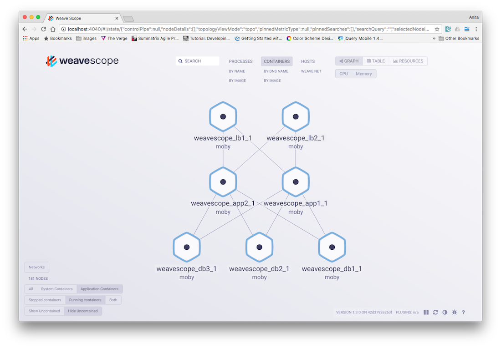
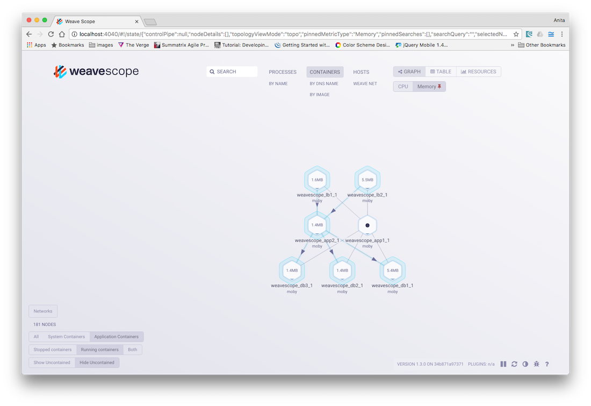
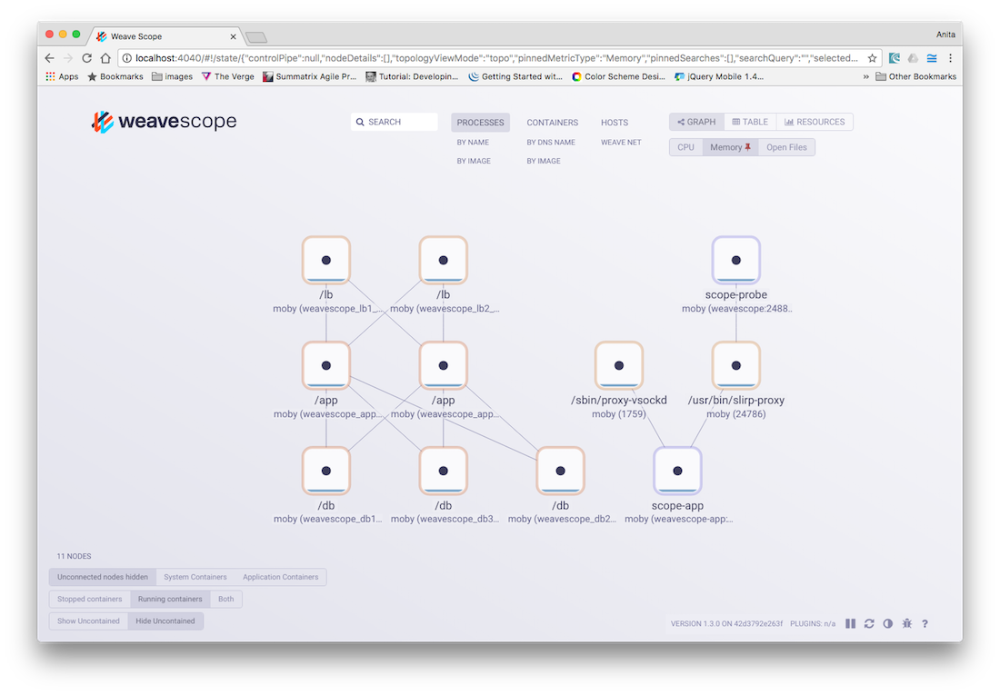

Weave Scope automatically detects and monitors every host, container and process in your infrastructure, builds a map showing their inter-communications and then presents an up-to-date view in a web interface. You can visualize, monitor and control your distributed applications and troubleshoot bottlenecks, memory leaks or any other issues. It does this without requiring changes to your code or configuration, and without having to make declarations about your infrastructure that become out-of-date and stale. 

Weave Scope can be deployed to any infrastructure, and works well in all cloud and bare-metal environments.

[Weave Cloud](http://cloud.weave.works) centrally manages and shares access to your Weave Scope user interface. With the cloud service, you run Weave Scope probes locally across your machines and then monitor the infrastructure from the Weaveworks website where the Weave Scope app feed is hosted. 

You can also launch Weave Scope in stand-alone mode, and run Weave Scope locally in your own environment. See, ["Monitoring Docker Containers with Weave Scope"](/monitor-docker-containers/) for more information and an example on how to use it. 

## Signing Up With Weave Cloud Service

To register with Weave Cloud, go to [https://cloud.weave.works](https://cloud.weave.works), and enter your email address. A confirmation email will be sent with further instructions. 

Login to Weave Cloud and click the settings icon in the top right hand corner to obtain the cloud service token:

## Running Weave Cloud

Use the Weave Cloud service token to launch the Weave Cloud agents onto every machine that you want to monitor:

~~~bash
+sudo wget -O /usr/local/bin/scope \
+  https://github.com/weaveworks/scope/releases/download/latest_release/scope
+sudo chmod a+x /usr/local/bin/scope
sudo scope launch --service-token=<token>
~~~

## Viewing Your Infrastructure Setup

With Weave Scope probes deployed and the app launched, go to [https://cloud.weave.works](https://cloud.weave.works) to see an immediate overview of your containerized app displayed in your browser. 

Weave Scope presents all nodes in a particular order, and presents all clients above servers. As a general rule, you can read a Weave Scope view by going from top to bottom.

**An Overview of the App:**

A line between two nodes within the view represents a connection between containers. To help you understand the connections in your view, hover over a container or a connection to highlight all connected containers. This is especially useful for infrastructures that use a lot of containers.

## Viewing Metrics

Metrics about a node are displayed by clicking on a node in the Weave Scope view. Basic metrics for the node will depend on the type, but generally will contain: the image and process names, sparklines showing memory consumption and performance, as well as any network metrics, like the number of TCP connections.

>**Note:** In this view, you can Pause, Restart, and Stop containers, and for this reason, access to Weave Scope should be restricted to trusted individuals. 

## Grouping By Containers or Hosts

Weave Scope works great in topologies of any size, but if there are too many nodes in the view at once, you can use the grouping features to make the view simpler to understand. For example, in the containers view, click the `By Image` button to merge all the containers that are running the same container image together.

**Grouped Container View:**

In our stack all instances get merged together into single nodes, even when they exist across hosts. The result is a logical, rather than physical, lens on the infrastructure — something that application developers intuitively understand. 

Grouping all instances and applications are great for application developers, but for those who have a more operations-oriented background, there is also the option to group `By HOST`. 

Click on `Applications` to show all the processes communicating in your network. This is the most granular view of Weave Scope.

Weave Scope collects information in a very flexible data model, so that you can visualize all possible transformations within your network.

**An Overview of all Processes:**

## Stopping Weave Scope

To stop Weave Scope: 

~~~bash
sudo scope stop
~~~

## Getting Help

If you encounter any problems with this application or documentation or you would like to get in touch, contact us via [Help and Support](https://www.weave.works/help/).

