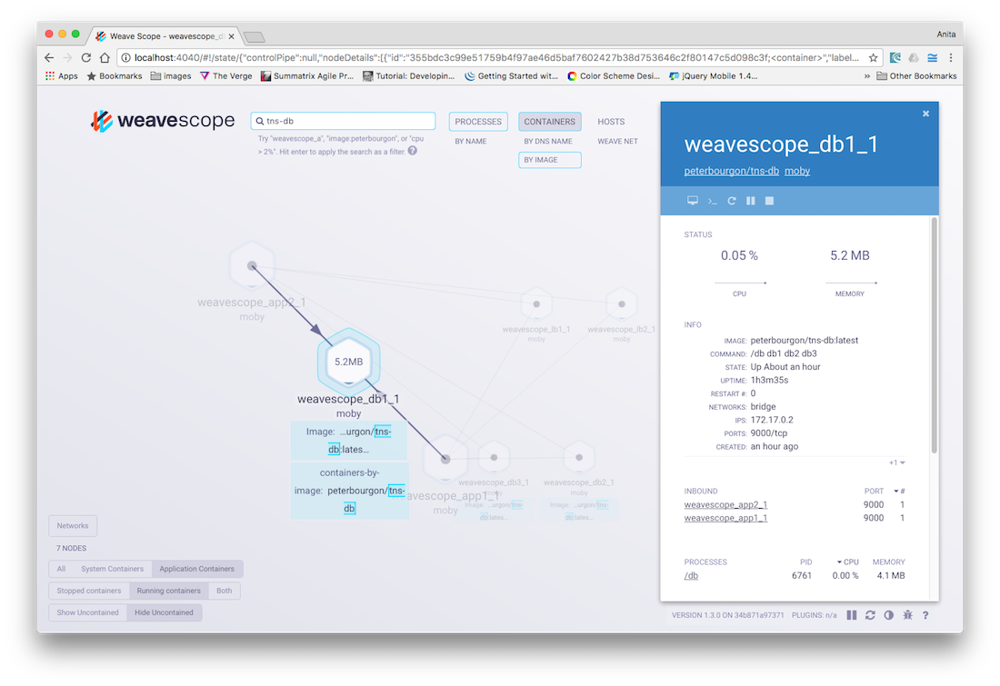

Weave Scope automatically detects and monitors every host, Docker container and process in your infrastructure, builds a map showing their communication pathways and then presents an up-to-date view of your infrastructure in a web interface. You can visualize, monitor and control your distributed applications and troubleshoot bottlenecks, memory leaks or any other issues. It does this without requiring changes to your code or configuration, and without having to make declarations about your infrastructure that become out-of-date and stale. 

Weave Scope can be deployed to any infrastructure, and works well in all cloud and bare-metal environments.

## How Weave Scope is Deployed?

There are two ways in which Weave Scope can be deployed: as a standalone configuration, or if you don't want to bother with the administration yourself, you can sign up for [Weave Cloud](https://cloud.weave.works).

### Weave Cloud

Weave Cloud manages and shares access to your Weave Scope user interface. With [Weave Cloud](https://cloud.weave.works), Weave Scope probes are run locally on your machines, but the Scope app and its user interface are hosted on the Weave Cloud. Microservices are monitored in a browser from the [https://cloud.weave.works](https://cloud.weave.works) website.

Sign up at [https://cloud.weave.works](https://cloud.weave.works) to obtain a secure service token. 

### Weave Scope Standalone

In standalone mode, all Weave Scope components are run locally: the probes and the app are deployed to your machines, and then the user interface is displayed in your browser to view the infrastructure setup.

## About This Guide

This guide demonstrates how to launch and use Weave Scope in standalone mode. You will: 

1. Deploy a 3-tiered web application stack, consisting of a pool of data services, a set of custom application servers and a load balancing layer. 
2. Launch Weave Scope to visualize and monitor containers and return useful intelligence. 

This tutorial takes about 15 minutes to complete and while some UNIX skills are required, it does not require any programming skills to complete. 

## What You Will Use

* [Weave Net](https://weave.works)
* [Weave Scope](https://weave.works/weave-scope/)
* [Docker](https://docker.com)
* [Docker Compose](https://www.docker.com/docker-compose)

## Before You Begin

If you are using OS X install [Docker for Mac](https://docs.docker.com/docker-for-mac/install/) or [Docker for Windows](https://docs.docker.com/docker-for-windows/install/) which provides all of the tools you need to complete this guide.

For other operating systems, see [Installing Docker](https://docs.docker.com/engine/installation/). 

### Deploying the Sample Application

To demonstrate Weave Scope in stand-alone mode, you will deploy an example application using Docker Compose. This example uses a single host, but keep in mind that Weave Scope works across on multiple hosts, or even across data centers and cloud providers.

Install Docker and Docker Compose onto the VM by running:

~~~bash
$ wget -qO- https://get.docker.com/ | sh
$ sudo curl -L https://github.com/docker/compose/releases/download/1.5.1/docker-compose-`uname -s`-`uname -m` -o /usr/local/bin/docker-compose
$ sudo chmod +x /usr/local/bin/docker-compose
~~~

And next, use Docker Compose to launch all of the components of the sample application:

~~~bash
$ wget -O docker-compose.yml http://git.io/scope-compose
$ docker-compose up -d
~~~

If you are using OSX, replace `wget` with curl: 

~~~bash
$ curl -L -o https://get.docker.com/ | sh
~~~

Check that all seven application containers are running by typing `docker ps`:

~~~bash
CONTAINER ID  IMAGE            PORTS                 NAMES
fe41c10a63ca  tns_lb1:latest   0.0.0.0:8001->80/tcp  tns_lb1_1
c94005d87115  tns_lb2:latest   0.0.0.0:8002->80/tcp  tns_lb2_1
8c15a1325094  tns_app1:latest  8080/tcp              tns_app1_1
645386356a2e  tns_app2:latest  8080/tcp              tns_app2_1
e34ccea042fd  tns_db3:latest   9000/tcp              tns_db3_1
c0d53d1327b4  tns_db2:latest   9000/tcp              tns_db2_1
0a920e17818a  tns_db1:latest   9000/tcp              tns_db1_1
~~~

Verify that the containers are reachable by curling one of the tns_lb instances. 

By default, the containers listen on ports 8001 and 8002:

~~~bash
$ curl localhost:8001
~~~

~~~
lb-6d5b2352f76d4a807423ce847b80f060 via http://app1:8080
app-60fbe0a31aee9526385d8e5b44d46afb via http://db2:9000
db-e68d33ceeddbb77f4e36a447513367e8 OK
~~~

## Sign Up for Weave Cloud

To begin, sign up for Weave Cloud and deploy the Scope probes on your laptop.  

After verifying that the app works as it should on your laptop, you'll then install the Weave Cloud probes to production, set up a Kubernetes cluster and deploy the app it, and then compare production with the app on your laptop.  

To sign up for Weave Cloud:

1.  Go to <a href="https://cloud.weave.works" target="_blank"> Weave Cloud </a> <!-- lkj_ -->
2.  Sign up using either a Github, or Google account or use an email address.
3.  Obtain the cloud token from the User settings screen:

### Launch the Weave Cloud Agents

Launch the Scope probes using the token you obtained when you signed up for the service:

<!-- TODO maybe this should use the k8s scope yaml in the launcher -->

~~~bash
curl --silent --location https://git.io/scope --output /usr/local/bin/scope
sudo chmod +x /usr/local/bin/scope
scope launch --service-token=<cloud-token>
~~~

**Where,**

* `<cloud-token>` - is the token that appears on the settings page, once you’ve logged into Weave Cloud.

### Launching Weave Scope in Standalone Mode

With the sample app running, install and launch Weave Scope:

~~~bash
sudo curl -L git.io/scope -o /usr/local/bin/scope
sudo chmod a+x /usr/local/bin/scope
scope launch
~~~

Point your web browser to: `http://192.168.99.100:4040/` (or to the address displayed to you in the terminal window after Weave Scope was launched).

## Launching Weave Scope When Using Weave Net to Connect Containers

If you are running Weave Scope on the same machine as a Weave network, Weave Scope uses `weaveDNS` to discover other instances of Weave Scope. 

Weave Scope registers itself using the address `scope.weave.local`. Each probe then, sends its report to every app registered under this address. In other words, if you are running Weave Net with DNS, you do not need to take any further steps. 

If you don't want to use weaveDNS, you can instruct Weave Scope to cluster with other Weave Scope instances on the command line. Hostnames and IP addresses are acceptable, both with and without ports, for example:

~~~bash
scope launch scope1:4030 192.168.0.12 192.168.0.11:4030
~~~

Hostnames are regularly resolved as A records, where each answer is used as a target.

`scope launch` prints out the URLs to which you can point your browser and display the user interface.

## Visualizing Infrastructure

Once Weave Scope is launched in your browser, an immediate overview of the infrastructure are split up by views which include: Processes, Containers and Hosts. And if you were running this app in an orchestrator, an additional view also appears. If the app is running in Kubernetes Pods appear and if you are running in ECS then Tasks appears.  

The Weave Scope view is presented in an order with clients generally placed above servers. Read a Weave Scope view by going from top to bottom.

**An Overview of Application Layers:**

A line between two nodes within the view represents a connection between containers. To help you understand the connections in your view, hover over a container or a connection to highlight all connected containers and to also reveal communication direction. 

## Viewing Metrics

Metrics about a node are displayed by clicking on a node from one of the Scope views.  For example, to examine the metrics about one of the database (db) containers in this example, click on the database node. To assist you in finding this quickly enter `tns_db` into the search field. The search functionality allows simple operands and search terms may also be stacked to create more complex queries (see the Scope online help for a list of allowed operands). 

**Metrics of the DB Container**:

The panel on the right shows information about the database, such as the image and process names, sparklines displaying memory consumption and peformance, as well as network metrics like the number of TCP connections.

In addition to this a terminal window can be launched that allows you to interact directly with a container. You can also view Docker logs, and can stop, pause and relaunch containers all from this same control panel. 

>**Important!** Because you can Pause, Restart, and Stop containers, access to the Weave Scope user interface should be restricted to trusted individuals.

## Processes Views

Weave Scope works great for infrastructures of any size, but if there are too many containers on the screen at once for you to manage, the Process view makes your cloud native app easier to understand. 

All db, app, and lb instances are merged together into single nodes, even when they exist across hosts. This is a logical, rather than a physical lens on the infrastructure — something that application developers intuitively understand. Detailed statistics are also merged.

The logical view is useful for application developers, but for those with a more operations-oriented background,  a `Hosts` view is also provided that displays a standard physical layout of the infrastructure.

**An Overview of all Processes:**

### Filtering Views

Use Weave Scope’s filtering features to further refine a view:  

The Container view can be filtered by: 

* Application or System
* Running, Stopped or Both
* Uncontained, Contained or Both
* Network

In addition to these high-level filters, your application can also show relative CPU and Memory consumption and when in the Processes view can show which processes have Open Files. When any of those filters are set, mousing over a node displays these metrics.

**Filter Containers by Application and Show Memory:**

## Stopping Weave Scope

To stop Weave Scope: 

~~~bash
sudo scope stop
~~~

## Conclusions

This guide demonstrated how to launch Weave Scope in standalone mode, so that you can visualize, monitor and control your container network to gain insight into your application. 

If you have any problems with this guide or would like to get in touch, contact us via [Help and Support](https://weave.works/help/).

